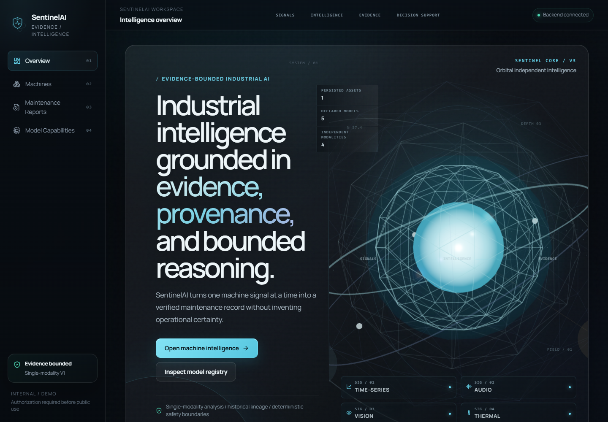
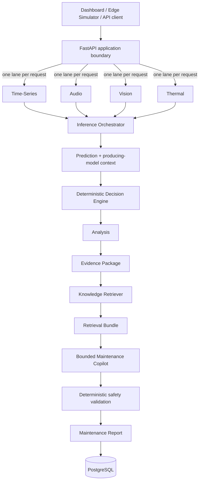
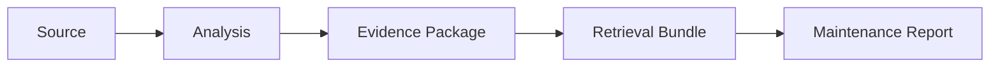
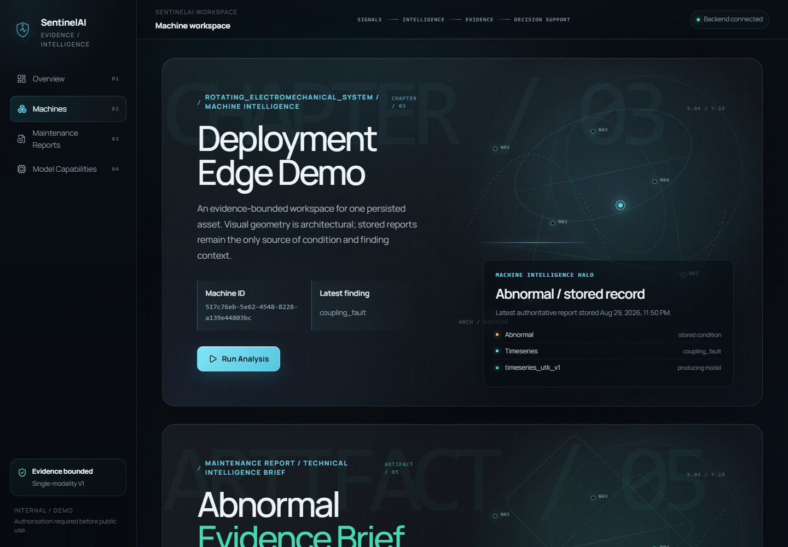
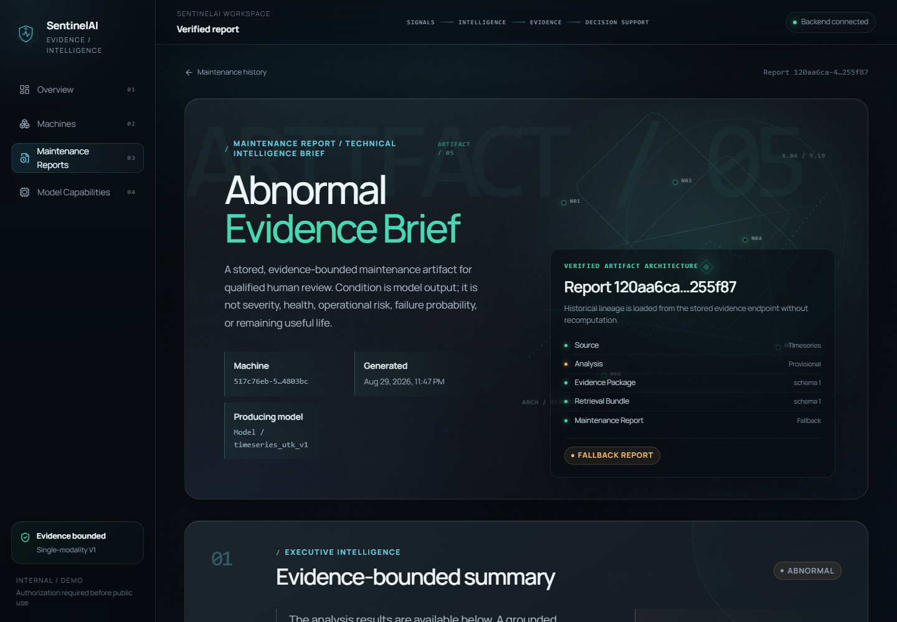
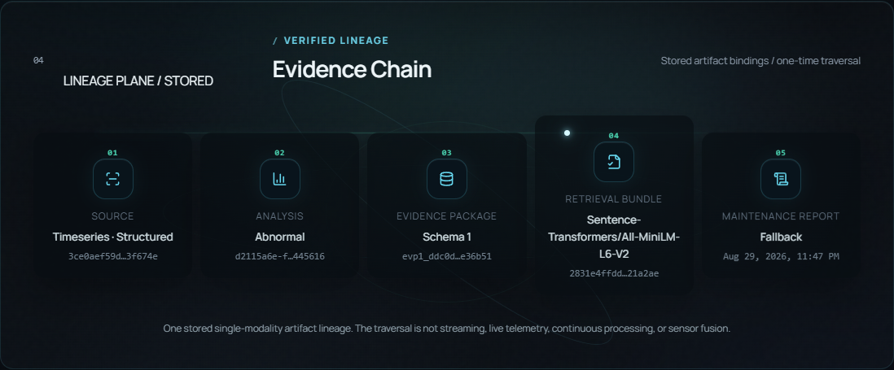
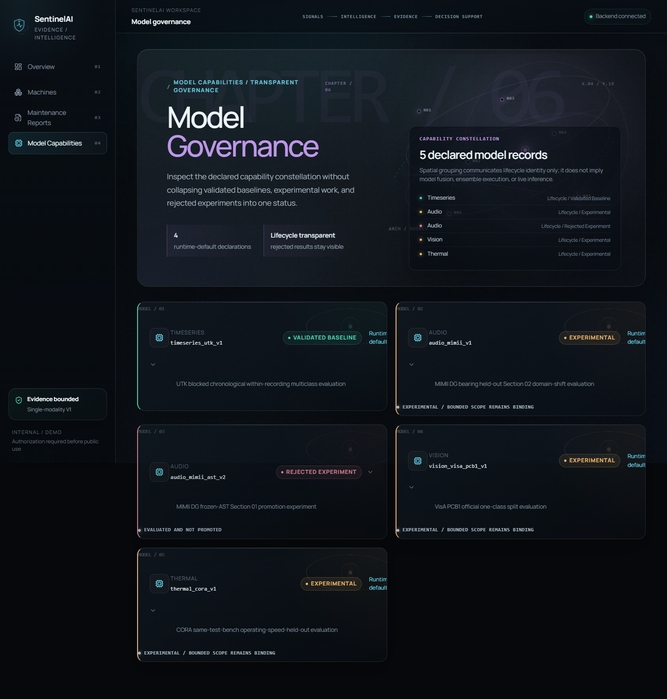

# SentinelAI

**Evidence-bounded machine intelligence from signal to stored maintenance record.**

[](https://github.com/harshjs19/SentinelAI/actions/workflows/ci.yml)


SentinelAI is an industrial machine-intelligence platform that connects independent
Time-Series, Audio, Vision, and Thermal analysis modules to deterministic decision
semantics, provenance-aware evidence, retrieval-bounded maintenance interpretation, and
a React engineering dashboard. Each V1 analysis uses **one modality**. The system does
not claim multimodal fusion, autonomous maintenance, or operational certainty.

> **Project status:** engineering-complete V1 for local or controlled deployment and
> portfolio demonstration. It is not approved for public-Internet operation.



## Why this system exists

An industrial classifier can rank a label with high confidence and still say nothing
defensible about physical fault severity, the health of the whole machine, the chance of
future failure, or operational risk. Those concepts require different evidence. Treating
them as interchangeable produces confident interfaces with weak scientific meaning.

SentinelAI keeps the boundary explicit:

```text
MODEL CONFIDENCE
    != FAILURE PROBABILITY
    != FAULT SEVERITY
    != MACHINE HEALTH
    != OPERATIONAL RISK
    != REMAINING USEFUL LIFE
```

ML output is therefore only the beginning of a workflow. A model produces a bounded
`Prediction`; deterministic logic creates an `Analysis`; the server records exact model
and source provenance in an `EvidencePackage`; retrieval creates a digest-bound
`RetrievalBundle`; and the Maintenance Copilot returns a constrained, validated report.
Unsupported claims remain unavailable rather than being filled with synthetic scores.

## Architecture worth inspecting

SentinelAI is a modular monolith. FastAPI owns the workflow boundary, PostgreSQL owns
durable history and idempotency, and the dashboard and Edge Simulator consume HTTP APIs.
The four model lanes are independent alternatives selected by request—not inputs to a
fusion layer.



The in-process `EventBus` publishes `PredictionProduced` and `AnalysisProduced`
sequentially inside one Python process. It is intentionally not a durable broker. The
controlled deployment consequently runs one Uvicorn worker; Kafka, RabbitMQ, retries,
and cross-process event delivery are outside V1.

### Historical evidence is read, not recomputed



The report-evidence API reads verified historical artifacts from PostgreSQL. Opening an
old report does **not** rerun inference, the Decision Engine, retrieval, or generation.
Producing-model identity is captured during the original inference—including model ID,
lifecycle status, validated scope, and confidence semantics—rather than reconstructed
later from whichever model is currently configured.

The detailed request, event, evidence, and deployment boundaries are in
[Runtime architecture](docs/runtime_architecture.md).

## What SentinelAI can do

- Run typed single-modality inference for supported Time-Series, WAV, image, and
  thermographic inputs.
- Convert predictions into deterministic `complete`, `provisional`, or
  `insufficient_evidence` analyses without deriving severity, health, or risk from
  confidence.
- Construct server-owned, digest-verified evidence and retrieval artifacts from the
  exact source and producing-model context.
- Produce deterministic or provider-backed maintenance reports through bounded
  generation, validation, at most one repair, and safe fallback.
- Persist a complete report chain atomically and replay idempotent requests across
  process restarts.
- Expose historical reports, authoritative evidence lineage, model lifecycle records,
  liveness/readiness, and request correlation through FastAPI.
- Demonstrate the workflow with an external HTTP-only Edge Simulator and a
  production-built dashboard.

## Model evidence and lifecycle

Lifecycle labels describe evidence maturity, not deployment certification. Detailed
protocols and complete metrics live in the tracked `evaluation/` artifacts and linked
model documents.

| Modality | Dataset and approach | Lifecycle | Verified result | Binding limitation |
| --- | --- | --- | --- | --- |
| Time-Series | UTK Bently Nevada recordings; selected logistic-regression pipeline | `validated_baseline` | blocked chronological test macro F1 **0.9418** | one recording per fault class; not unseen-session or unseen-machine validation |
| Audio | MIMII DG bearing; PCA reconstruction anomaly baseline | `experimental` | held-out Section 02 ROC AUC **0.5213** | near-chance cross-section/domain-shift result |
| Vision | VisA PCB1; frozen ResNet-18 patch nearest-neighbor detector | `experimental` | image ROC AUC **0.8964**; pixel ROC AUC **0.9834** | conservative runtime threshold recalled **0.08** of test anomalies; one dataset/camera scope |
| Thermal | CORA thermography; speed-held-out random forest on frozen ResNet-18 features | `experimental` | F60 frame macro F1 **0.1291**; experiment accuracy **1/9** | severe operating-speed shift on the same test bench |

The frozen-AST Audio V2 experiment remains visible as `rejected_experiment`. Its
predeclared Section 01 promotion score was **0.5158**, below the V1 reference score of
**0.5802**, so it was not promoted. A weak or rejected result is retained because model
governance is more useful when negative evidence is inspectable.

SentinelAI also declined to force frame-level Thermal + vibration fusion on CORA. The
pinned v2.1 release did not provide enough evidence to reproduce exact camera-to-signal
alignment: no common time zero, first-frame offset, or documented clock relationship was
found. The resulting gate is `PARTIAL / BLOCKED`, not a hidden approximation.

See [model capabilities](docs/model_capabilities.md), [Time-Series](docs/timeseries_baseline.md),
[Audio V1](docs/audio_baseline.md), [Audio V2](docs/audio_v2.md),
[Vision](docs/vision_baseline.md), [Thermal](docs/thermal_baseline.md), and the
[CORA alignment audit](docs/cora_alignment_feasibility.md).

## Decision, evidence, retrieval, and Copilot boundaries

The Decision Engine maps supported labels to findings and conditions. Findings preserve
the model's raw confidence kind. Analyses remain provisional when evidence cannot support
stronger conclusions; `health_score` and `risk_level` stay null in V1.

The `EvidencePackage` is an immutable, deterministic snapshot of machine identity,
source digest, Analysis, exact producing-model context, and claim availability. Its
digest proves stable identity and integrity—not objective truth, authorship, or a digital
signature. The retriever searches a curated, locally prepared corpus and binds selected
chunks, corpus identity, and embedding-model identity into a `RetrievalBundle`.

The Maintenance Copilot is analysis-scoped, retrieval-bounded, non-directive, and
validated after generation. It is not a chatbot, autonomous maintenance agent, or
operational-command system. Provider-backed output gets one repair attempt; invalid or
unavailable generation falls back safely. No OpenAI key is required to start SentinelAI,
run deterministic workflows, inspect history/evidence, execute the default Edge demo,
or render fallback reports.

## Dashboard

The dashboard makes the system's boundaries visible: stored machine state, raw confidence
semantics, scientific limitations, Evidence Chain, exact producing-model provenance, and
model lifecycle—including rejected work. Inspection Considerations remain non-directive.

| Machine Intelligence | Stored Maintenance Report |
| --- | --- |
|  |  |

| Authoritative Evidence Lineage | Model Governance |
| --- | --- |
|  |  |

Overview, Machines, Machine Intelligence, Maintenance Reports, Evidence Lineage, and
Model Capabilities all use real API data. The 3D scenes are representational: they do not
claim live telemetry, sensor fusion, or a physical digital twin. WebGL has a styled
fallback and decorative motion respects reduced-motion preferences.

## Quick start on Windows

Requirements: Python 3.12, Node.js 24, Docker Desktop, `uv`, Git, and PowerShell.

### First-time setup

```powershell
git clone https://github.com/harshjs19/SentinelAI.git
Set-Location SentinelAI
uv sync
Set-Location frontend
npm ci
Set-Location ..
```

Generated model and retrieval artifacts are intentionally not in Git. The application
and dashboard can start without them, but inference and full report creation require the
artifacts documented under [Controlled deployment](#controlled-deployment).

### Normal startup

```powershell
.\scripts\dev.ps1
```

The launcher validates prerequisites, starts or reuses development PostgreSQL and Redis,
applies Alembic migrations, starts FastAPI, waits for `/health`, then starts Vite and
opens the dashboard on its actual selected port.

### Shortest end-to-end demo

Create or select a compatible machine, then pass its real ID to the simulator:

```powershell
$body = @{ name = "Demo Motor"; asset_type = "rotating_electromechanical_system" } | ConvertTo-Json
$machine = Invoke-RestMethod -Method Post -Uri "http://127.0.0.1:8000/machines" -ContentType "application/json" -Body $body
uv run python -m edge_simulator demo --machine-id $machine.id
```

Open the machine URL printed by the simulator. The command submits a deterministic
simulated Time-Series observation over HTTP, then reads the stored report, evidence, and
history through the same public API.

## Edge Simulator

`edge_simulator` behaves like an external device client: it imports no backend workflow
services and uses no database connection. `SIMULATED INPUT` creates deterministic
Time-Series samples; `RECORDED REPLAY` sends an explicitly selected local WAV, JPEG, or
PNG. The default demo needs no provider key.

```powershell
uv run python -m edge_simulator list
uv run python -m edge_simulator demo --machine-id <UUID>
uv run python -m edge_simulator run idempotent_replay --machine-id <UUID>
```

A Raspberry Pi has not been deployed or benchmarked and is not required. A future Pi
adapter would replace the observation source while preserving the HTTP client contract.
See [Edge Simulator](docs/edge_simulator.md) and the executable [demo guide](docs/demo.md).

## Controlled deployment

The validated deployment runs PostgreSQL, a one-shot Alembic migration job, one FastAPI
worker, and an unprivileged static Nginx frontend. Only the frontend is published, on
localhost by default.

```powershell
Copy-Item .env.deploy.example .env.deploy
# Set a unique SENTINELAI_POSTGRES_PASSWORD in .env.deploy.
docker compose --env-file .env.deploy -f compose.deploy.yml up --build -d
.\scripts\smoke_deployment.ps1
```

Before expecting inference, mount the ignored `models/` artifacts and AST/ResNet encoder
snapshots, writable `knowledge/chroma/` persistence, and read-only
`knowledge/embeddings/` snapshot described in [deployment.md](docs/deployment.md).
Images build from a clean clone; a clean clone is not full-inference-ready.

Shutdown preserves the PostgreSQL volume:

```powershell
docker compose --env-file .env.deploy -f compose.deploy.yml down
```

This topology is **local / controlled deployment ready**, not public-Internet ready.

## Testing, CI, and operations

The final local verification baseline is **682 passing backend tests** with **2 optional
real-encoder skips**, **16 frontend unit tests**, and **5 Playwright browser scenarios**,
plus Ruff, formatting, dependency, Alembic, Compose, Docker build, and browser checks.
No test-count claim implies complete coverage.

The [GitHub Actions workflow](.github/workflows/ci.yml) is configured for pull requests
and pushes to `main`. It validates Python 3.12 with PostgreSQL 16, migrations, Ruff,
pytest, Node 24 lint/type/tests/build, Playwright Chrome, both Docker image builds, and
deployment Compose configuration. It does not call a model provider, use paid
credentials, publish images, or deploy to a cloud. Remote CI success is not claimed here.

Operational boundaries are deliberately small:

- `/health` is cheap process liveness; `/ready` performs only a PostgreSQL `SELECT 1`.
- API responses carry bounded `X-Request-ID` correlation.
- deployment request logs are structured JSON with method, path, status, and duration;
  request bodies, media, questions, authorization data, and idempotency keys are excluded.
- migration success gates API startup, and container healthchecks run no inference.
- public errors are sanitized; local artifacts and paths are not exposed in responses.

## Repository map and documentation

| Path | Purpose |
| --- | --- |
| `backend/` | FastAPI composition, routes, services, SQLAlchemy persistence, and operational boundaries |
| `domain/` | framework-independent machine, prediction, finding, and Analysis semantics |
| `ai_core/` | generic predictor, evaluation, capability, and producing-model contracts |
| `modules/` | independent inference, Decision Engine, evidence retrieval, and Copilot modules |
| `frontend/` | React/TypeScript dashboard and browser tests |
| `edge_simulator/` | external HTTP-only simulation and replay client |
| `evaluation/` | tracked evaluation results and frozen experimental records |
| `tests/` | backend, scientific-contract, persistence, and workflow tests |
| `docs/` | model protocols, architecture, safety decisions, demo, deployment, and portfolio notes |
| `scripts/` | local startup, artifact preparation, audits, evaluation, and smoke checks |

Start with:

- [Runtime architecture](docs/runtime_architecture.md)
- [Decision semantics](docs/decision_engine.md)
- [Evidence Package](docs/evidence_package.md)
- [Retriever](docs/retriever.md)
- [Maintenance Copilot](docs/maintenance_copilot.md) and [adversarial evaluation](docs/copilot_evaluation.md)
- [Persistence and idempotency](docs/maintenance_workflow_persistence.md)
- [Dashboard scientific contract](docs/premium_dashboard_v1.md)
- [Controlled deployment](docs/deployment.md)
- [Demo walkthrough](docs/demo.md) and [portfolio/interview notes](docs/portfolio.md)

Dataset and model attribution is recorded in each evaluation document; research datasets,
model weights, generated embeddings, and demo media are not redistributed in Git.

## Licensing

SentinelAI's original project code and documentation are released under the
[Apache License 2.0](LICENSE). Third-party datasets, pretrained models, benchmark
content, libraries, and externally managed artifacts remain subject to their respective
licenses and terms; their inclusion or reference does not relicense that material.

## Known limitations and next steps

- V1 is single-modality per analysis; no cross-modal calibration or fusion exists.
- Only Time-Series is a validated baseline, and its one-recording-per-class dataset does
  not establish unseen-session or field generalization.
- Audio, Vision, and Thermal remain experimental; their negative and weak results are
  intentionally visible.
- CORA frame-level fusion remains blocked on unreproducible alignment evidence.
- Full inference/retrieval depends on ignored external artifacts.
- The process-local EventBus implies one worker in the controlled deployment.
- Live provider evaluation and human review remain pending; provider-free fallback is not
  equivalent to provider-generated interpretation.
- No physical Raspberry Pi deployment or performance claim exists.
- Benchmark datasets support research and demonstration, not industrial field validation.
- Public operation still needs authentication, authorization, TLS, device identity,
  rate limiting, retention/deletion policy, secret management, backups, and ingress
  hardening.

A public production design would address those controls and durable multi-instance event
delivery before adding new model claims. SentinelAI's current value is the inspectable
chain between bounded model evidence and a reproducible maintenance record—not a claim
that the chain has already solved industrial deployment.
