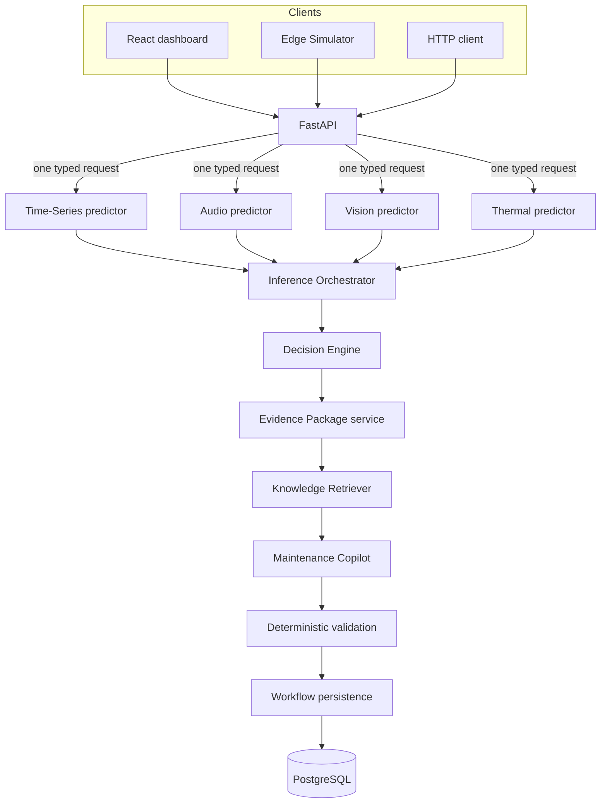
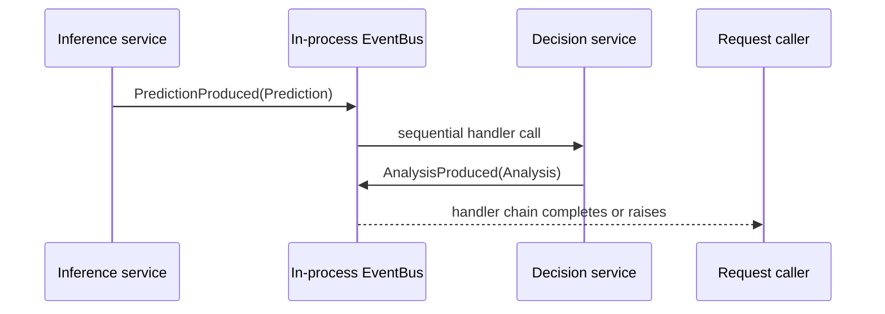
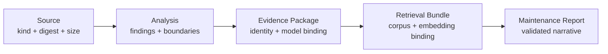
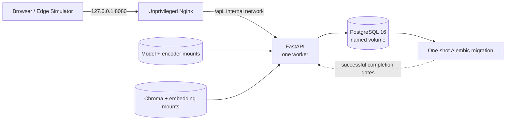

# Runtime architecture

SentinelAI V1 is a modular monolith with explicit scientific and operational boundaries.
It supports four independent analysis lanes, but one workflow execution accepts exactly
one modality, produces one `Prediction`, and creates one `Analysis`. Nothing in the
runtime combines Time-Series, Audio, Vision, and Thermal evidence into a fused result.

## System boundary



The dashboard does not calculate condition, lifecycle, evidence identity, or provenance.
The Edge Simulator is an external HTTP client and imports no backend workflow service.
FastAPI is the application boundary responsible for authoritative machine lookup,
inference selection, source derivation, workflow construction, and transaction scope.

## Server-owned request path

```text
MaintenanceWorkflowService(typed single-modality request)
    -> authoritative Machine lookup
    -> modality inference
    -> InferenceResult(Prediction, ProducingModelContext)
    -> Decision Engine(Prediction)
    -> Analysis
    -> EvidencePackageService(Analysis, ProducingModelContext)
    -> Knowledge Retriever(EvidencePackage)
    -> RetrievalBundle
    -> MaintenanceCopilotService
         -> deterministic report path
         OR bounded generate -> validate -> one repair/fallback
    -> verified MaintenanceWorkflowResult
    -> MaintenanceWorkflowPersistenceService
    -> one request/application transaction
```

Clients provide a machine ID, one typed source, a closed Copilot intent, and an optional
bounded question. They cannot submit derived `Prediction`, `Analysis`, `EvidencePackage`,
`RetrievalBundle`, source digest, or producing-model claims. The server hashes the exact
samples or bytes used for inference and keeps the model context returned by the same
execution.

The Decision Engine receives only `Prediction`; model lifecycle metadata cannot alter its
finding rules. Classifier or empirical anomaly confidence remains the model's declared
raw evidence type. Health score and operational risk remain unavailable in V1, and the
`SINGLE_MODALITY_EVIDENCE` limitation stays visible in the report.

## Events and worker constraint

The `EventBus` coordinates local application behavior only:



- handlers execute sequentially in registration order;
- handler failures propagate to the publisher;
- the bus has no durability, replay, retry, dead-letter queue, or cross-process delivery;
- each Uvicorn worker owns a separate bus instance;
- Redis does not carry inference or workflow events.

The controlled deployment therefore runs one Uvicorn worker. Adding workers without a
durable delivery design would divide event subscribers into separate delivery domains.
Kafka or RabbitMQ would add operational cost without solving a current V1 requirement;
durable asynchronous work would require a separate design and explicit delivery
guarantees.

## Exact provenance and evidence lineage

`InferenceOrchestrator` binds each predictor to immutable producing-model metadata and
returns `InferenceResult(Prediction, ProducingModelContext)`. Composition verifies the
runtime model ID against the declared capability before inference. The exact context then
travels beside the prediction until evidence construction.

`Prediction` and `Analysis` remain free of lifecycle metadata. `EvidencePackageService`
fails closed if an evidence-bearing Analysis lacks the execution-time context; it never
looks up the current default later. This makes the distinction explicit:

```text
current runtime default != historical producing model
```

The stored lineage is:



Package, retrieval, and report digests provide deterministic identity and integrity
checks. They are not digital signatures and do not prove that a model prediction is
physically true.

The complete chain is stored atomically. Historical report and evidence endpoints load
the verified persisted records. A historical GET performs zero inference, Decision
Engine execution, retrieval, or LLM generation and does not reconstruct provenance from
current defaults. Responses omit raw source data, full retrieval chunks, and local paths.

## Persistence and idempotency

PostgreSQL stores the machine, Analysis, EvidencePackage, RetrievalBundle,
MaintenanceReport, and request-idempotency record. The FastAPI `get_session()` dependency
owns the transaction and uses function scope, so commit or rollback completes after the
path operation but before the response is sent.

Idempotency is semantic, not merely an in-memory cache. A bounded key is associated with
the machine, modality, source digest, and request intent. Exact replay returns the stored
report across process restart. Reusing a key for a different semantic request is rejected.
The full key is not logged.

## Retrieval and Copilot

Retriever V1 is a lazily initialized internal component backed by a prepared Chroma
collection and a pinned local embedding snapshot. It does not run on application startup
or expose arbitrary vector search. Retrieval planning is derived from the verified
EvidencePackage; selected chunks and corpus/embedding identities are bound into the
RetrievalBundle.

The Maintenance Copilot is request-local, analysis-scoped, and closed-book over the
provided evidence and retrieval bundle. Its graph has no database access, tools,
checkpointing, memory, or streaming. Deterministic validation enforces citations,
non-directive Inspection Considerations, unavailable-claim boundaries, and report shape.
A provider-backed attempt may be repaired once; otherwise the workflow returns the safe
fallback. The default composition supplies no provider, so deterministic workflows and
provider-unavailable fallback work without `OPENAI_API_KEY`.

## Controlled deployment



Only Nginx is published, on loopback. FastAPI and PostgreSQL remain internal. The
migration service waits for database health, applies committed revisions, and must exit
successfully before the API starts. `/health` checks process liveness; `/ready` performs
only a PostgreSQL `SELECT 1`. Neither executes models, retrieval, Redis, or providers.

Runtime artifacts remain deployment inputs:

- `/app/models` is a read-only mount for Joblib models and AST/ResNet snapshots;
- `/app/knowledge/embeddings` is a read-only embedding-model snapshot;
- `/app/knowledge/chroma` is writable because embedded Chroma opens SQLite in write mode.

The images build from a clean clone, but full inference/retrieval does not work until
those ignored artifacts are supplied. Missing models retain explicit availability errors;
the runtime does not download or fabricate replacements.

## Operational and public boundaries

Deployment requests receive `X-Request-ID`, and JSON request logs contain only timestamp,
level, event, request ID, method, path, status, and duration. Raw media, samples,
questions, idempotency keys, credentials, authorization headers, cookies, and environment
dumps are excluded. Unhandled public errors are generic.

This topology is suitable for local workstations and controlled demonstrations. Public
operation still requires authentication and authorization, TLS termination, device
identity, rate limiting, retention/deletion policy, secret management, backup/recovery,
and hardened ingress. See [deployment.md](deployment.md) for exact commands and mount
requirements.
